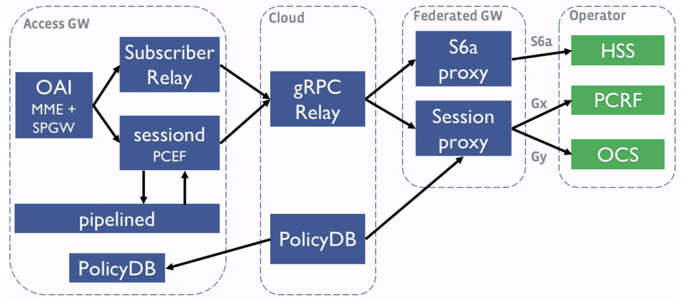

# Gy Interface

## Functional Description

### Protocol Stack Compliance

| Network | Transport | Application 
| --- | --- | --- | 
| IPv4 | TCP | Diameter 
| IPv4 | SCTP | Diameter 
| IPv6 | TCP | Diameter 
| IPv6 | SCTP | Diameter 

**TODO:** Add here where to configure those

## Procedures

List of supported procedures as described by [32.299] Rel 16

- Offline Charging
    - Imediate Event Charging: 
      - Not Supported
    - Event Charging with Unit Reservation
      - Not Supported
    - Session Charging with Unit Reservation
      - Not Supported
- Online Charging
    - Imediate Event Charging: 
      - Not Supported
    - Event Charging with Unit Reservation
      - Not Supported
    - Session Charging with Unit Reservation
      - Supported

## Gy Message Compliance

| Message | Abbreviation | Direction | Compliance | Supported |
| --- | --- | --- | --- | --- |
| Credit Control Request - Initiate | CCR-I | FeG -> OCS | TS 32.299 Rel ?? | Yes
| Credit Control Answer - Initiate | CCA-I | OCS -> FeG | TS 32.299 Rel ?? | Yes
| Credit Control Request - Update | CCR-U | FeG -> OCS | TS 32.299 Rel ?? | Yes
| Credit Control Answer - Update | CCA-U | OCS -> FeG | TS 32.299 Rel ?? | Yes
| Credit Control Request - Terminate | CCR-T | FeG -> OCS | TS 32.299 Rel ?? | Yes
| Credit Control Answer - Terminate | CCA-T | OCS -> FeG | TS 32.299 Rel ?? | Yes

### Credit Control Request (CCR)

#### Supported AVPs

| AVP | Supported | Code Ref | Notes |
| --- | --- | --- | --- |
| SessionID | Yes | [1] | Encoded host + session-id
| UserEquipmentInfoValue | Yes | [1] | 0x1
| EventTimestamp | Yes | [1] 
| AuthApplicationID  | Yes | [1]
| CCRequestType  | Yes | [1]
| ServiceContextID | Yes | [1]
| CCRequestNumber | Yes | [1]
| SubscriptionID[IMSI/MSISDN]  | Yes | [1] | MSISDN just added if subscriber has this value
| &nbsp;&nbsp;&nbsp;&nbsp; SubscriptionIDType  | Yes | [1]
| &nbsp;&nbsp;&nbsp;&nbsp; SubscriptionIDData  | Yes | [1]
| UserEquipmentInfo[IMEI]  | Yes | [1] | Only added if request has IMEI
| &nbsp;&nbsp;&nbsp;&nbsp; UserEquipmentInfoType  | Yes | [1]
| &nbsp;&nbsp;&nbsp;&nbsp; UserEquipmentInfoData  | Yes | [1]
| TGPPPDPType  | Yes | [2]
| TGPPRATType  | Yes | [2]
| TGPPSelectionMode  | Yes | [2]
| TGPPNSAPI  | Yes | [2]
| CGAddress  | Yes | [2]
| PDPAddress  | Yes | [2]
| SGSNAddress  | Yes | [2]
| GGSNAddress  | Yes | [2]
| TGPPSGSNMCCMNC  | Yes | [2]
| TGPPGGSNMCCMNC  | Yes | [2]
| CalledStationID  | Yes | [2]
| TGPPUserLocationInfo  | Yes | [2]
| TGPPChargingID  | Yes | [2]
| PSInformation | Yes | [2]
| ServiceInformation | Yes | [2]
| DestinationHost | Yes | [3] | Only added if request has destination Host
| RatingGroup | Yes | [4]
| ServiceIdentifier | Yes | [4]
| RequestedServiceUnit | Yes | [4]
| CCInputOctets | Yes | [4]
| CCOutputOctets | Yes | [4]
| CCTotalOctets | Yes | [4]
| ReportingReason | Yes | [4]
| UsedServiceUnit | Yes | [4]
| MultipleServicesCreditControl | Yes | [4]

Code References:

- [1] feg/gateway/services/session_proxy/credit_control/gy/gy_client.go:createCreditControlMessage
- [2] feg/gateway/services/session_proxy/credit_control/gy/gy_client.go:getServiceInfoAvp
- [3] feg/gateway/services/session_proxy/credit_control/gy/gy_client.go:getAdditionalAvps
- [4] feg/gateway/services/session_proxy/credit_control/gy/gy_client.go:getMSCCAVP

### Credit Control Answer

When is this trigered?

Which AVPs are cunrrently supported?

## Abbreviations

| | |
| --- | --- |
| OCS | Online Charging System
| FeG | Federeated Gateway
| PCEF | Policy Charging Enforcement Function |

## References

[TS 32.299] - Diameter charging applications

## Integration tests study

ocsAndPcrfCreditExhaustionTestSetup
    How does usage monitors work?
    How does rating group works?

##### gy_enforcement_test

- TestGyCreditExhaustionWithCRRU
  - ocsAndPcrfCreditExhaustionTestSetup
    - Setup static, dinamic and usage monitor rules
  - QuotaGrant
    - Create config for quota grant
  - NewGyCCRequest
    - Create the CCR-I request
  - NewGyCCAnswer
    - Create the CCA-I answer with granted quota
  - NewGyCreditControlExpectation
    - ???
  - QuotaGrant
    - Create config for quota grant
  - NewGyCCRequest
    - Create CCR-U request
  - NewGyCCAnswer
    - Create CCA-U answer with granted quota
  - NewGyCreditControlExpectation
    - ???
  - setOCSExpectations
    - ???
  - AuthenticateAndAssertSuccess
    - ???
  - GenULTraffic
    - generate fake traffic with
  - GetPolicyUsage
    - ???
  - AssertAllGyExpectationsMetNoError
  - NewGyCCRequest
  - NewGyCCAnswer
  - NewGyCreditControlExpectation
  - setOCSExpectations
  - GenTrafficRequest
  - GenULTraffic
  - AssertAllGyExpectationsMetNoError
- TestGyCreditValidityTime
- TestGyCreditExhaustionWithoutCRRU
- TestGyLinksFailureOCStoFEG
- TestGyCreditExhaustionRedirect
- TestGyCreditUpdateCommandLevelFail
- TestGyAbortSessionRequest

Objectives:
- Clearly communicate what is supported and what is not.
- Allow partner to understand how some unsuported feature can be executed with a different configuration.
